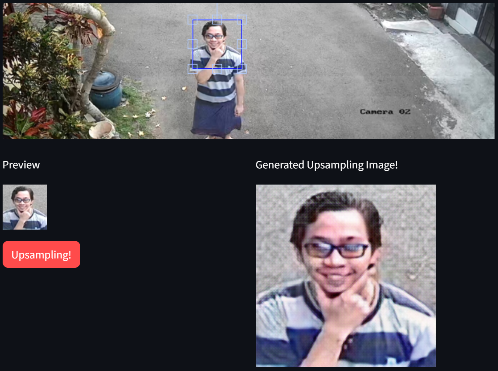
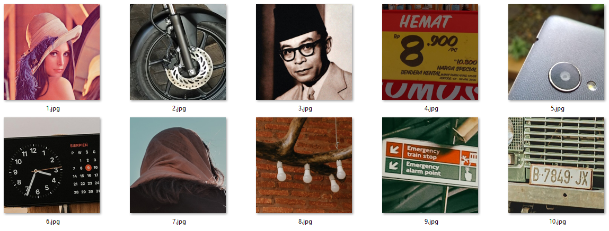
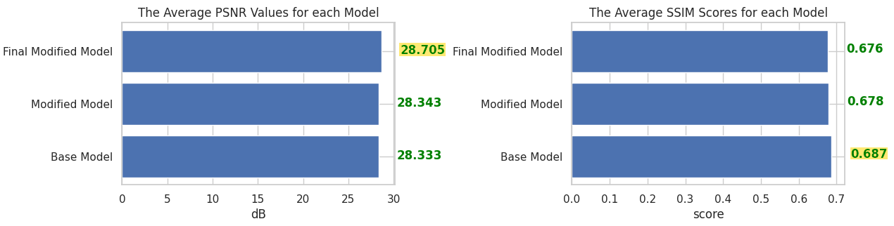
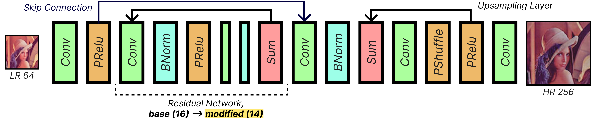
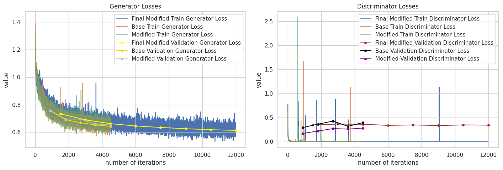
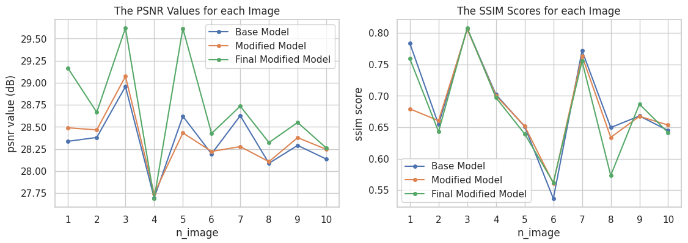
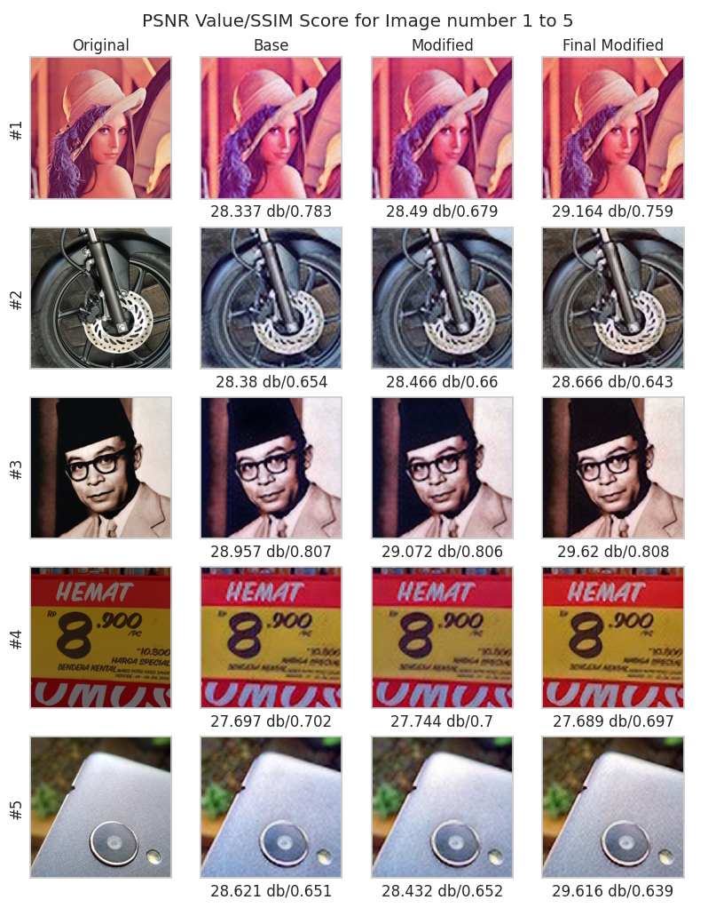
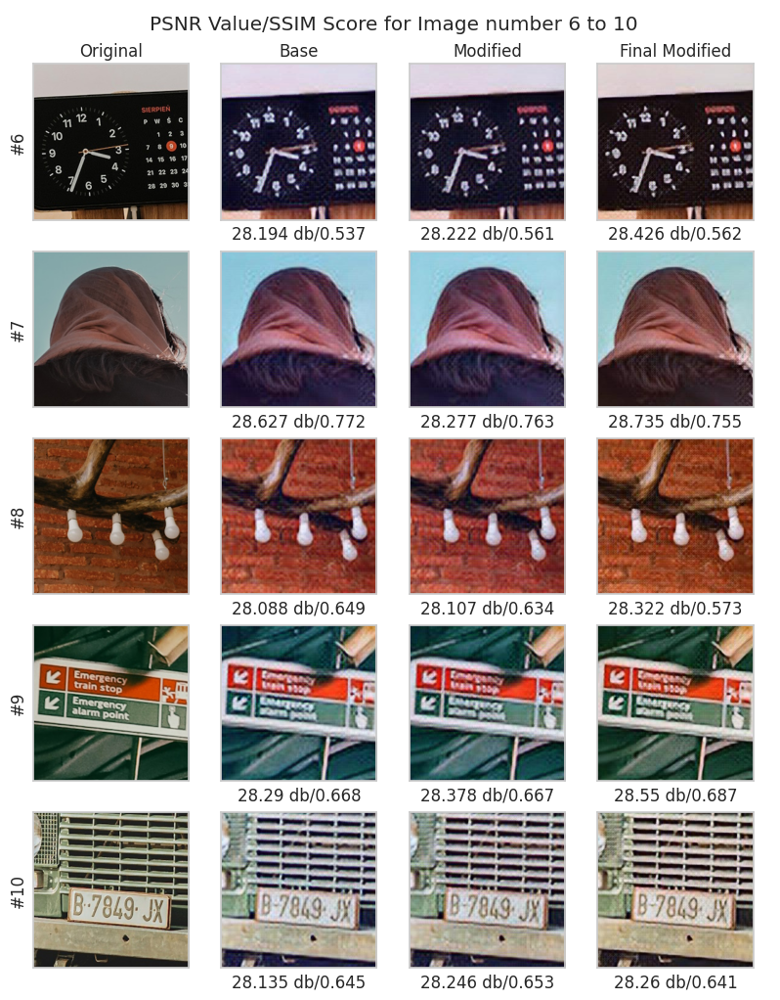

# Digital Image Resolution Enhancement in Security Feature
An alternative title of 'Peningkatan Resolusi Citra Digital pada Fitur Keamanan'

## Project Description

This repository was made by team GWS! to complete the final project challenge from Startup Campus. In this project, we propose a modified Super-Resolution Generative Adversarial Network (SRGAN) for CCTV system use. To use this project, you may want to install some specific library versions on your local machine. Also, note that the uploaded project is using a virtual environment.

## Contributor
| Full Name | Affiliation | Email | LinkedIn | Role |
| --- | --- | --- | --- | --- |
| Nicholas Dominic | Startup Campus, AI Track | nic.dominic@icloud.com | [link](https://linkedin.com/in/nicholas-dominic) | Supervisor |
| Muhammad Irfan Arisani | Universitas Dian Nuswantoro | arisaniirfan@gmail.com | [link](https://www.linkedin.com/in/muhammad-irfan-arisani-224068228/) | Project Leader |
| Rahma Absoh Dwiyanti | Universitas Sains Al-Qur'an | rahmaabsoh13@gmail.com | [link](https://www.linkedin.com/in/rahma-absoh-dwiyanti-13a50625b/) | Project Assistant |
| Jemi Arya Dwi Purnama | Universitas Singaperbangsa Karawang | slaydonejemi22@gmail.com | [link](https://www.linkedin.com/in/jemi-arya-dwi-purnama-293535244/) | Model Trainer 1 |
| Septia Mulya Ulfa | Universitas Malikussaleh | septiamulya09@gmail.com | [link](https://www.linkedin.com/in/septia-mulya-ulfa-3b6677292) | Model Trainer 2 |
| Yudha Nugraha | Universitas Lampung | yudhanugraha.cr7@gmail.com | [link](https://www.linkedin.com/in/yudha-nugraha-42b7191a2/) | Deployment 1 |
| Elang Anggri Sakti Hartanto | Universitas Gunadarma | Aguiladelaira@gmail.com | [link](https://www.linkedin.com/in/elang-anggri-sakti-hartanto-387333292/) | Deployment 2 |

## Setup
### Prerequisite Packages (Dependencies)
By the time this project was created, the following installed libraries and their versions will be:
- python == 3.10.0
- streamlit == 1.28.2
- [streamlit-cropper](https://github.com/turner-anderson/streamlit-cropper)
- torch == 2.1.1
- torchvision == 0.16.1

### Environment
This project has been tested in the following local machine specifications, any of those which better than this should give a better experience.
|||
| --- | --- |
| CPU | Intel i3-1215U |
| GPU | Integrated UHD Graphics |
| ROM | 1 TB SSD |
| RAM | 8 GB |
| OS | Windows 11 |

## Dataset

In this experiment, we are using Celeba datasets. The following datasets link can be found in Kaggle, but the other links will do.
- [Celeba](https://www.kaggle.com/datasets/jessicali9530/celeba-dataset)
- [Celeba HQ](https://www.kaggle.com/datasets/ipythonx/celebamaskhq)

## Results
### Model Performance
In this section, the base and modified version of Super-Resolution GAN will be shown below.

#### 1. Data Benchmark
We used the following 10 custom images to measure all of the model performance.


#### 2. Metrics
There are two main metrics for this GAN experiment, the average value of Peak Signal-to-Noise Ratio (PSNR) and Structural Similarity Index (SSIM).


The following score and several hyperparameter settings will be shown in the table below:
| model | iterations | optimizer | learning_rate | beta_1 | beta_2 | batch_size (train/test) | avg_psnr | avg_ssim |
| --- | --- | --- | --- | --- | --- | --- | --- | --- |
| base_srgan | 4500 | Adam | 0.00008 | 0.5 | 0.999 | 16/8 | 28.333 | **0.687** |
| modified_srgan | 4500 | Adam | 0.00008 | 0.49 | 0.999 | 14/7 | 28.343 | 0.678 |
| final_modified_srgan | 12000 | Adam | 0.00008 | 0.475 | 0.999 | 14/7 | **28.703** | 0.676 |

#### 3. Ablation Study
There is a simple minor modification, and that is the reduction number of residual networks in the generator architecture from 16 to 14.


This is because we are focusing on **efficiency** which can lead to faster execution time and smaller memory, but also resulting in identical performance. We also show one of the best PSNR values and SSIM scores from generated images for each model in the table below:
| model | n_residual_network | top_psnr | top_ssim |
| --- | --- | --- | --- |
| base_srgan | 16 | 28.95 | 0.806 |
| modified_srgan | 14 | 29.072 | 0.805 |
| final_modified_srgan | 14 | **29.619** | **0.807** |

#### 4. Training/Validation Curve
Below are the visualizations of the generator and discriminator loss history for each number of iterations.


### Testing
Below are the visualizations of the PSNR values and SSIM scores for each generated image using different types of models.


We also show the comparisons of each model to generate high-resolution images.



### Deployment
You can clone this repository and run the virtual environment from the `gws-deployment` folder. Remember to install the required package before running this project!

## Supporting Documents
- [Base Notebook](https://www.kaggle.com/code/balraj98/single-image-super-resolution-gan-srgan-pytorch)
- [Presentation Deck](https://docs.google.com/presentation/d/1rz9Kx8l-JccaFn__M3csNEv7wpWwz1Kf/edit?usp=sharing&ouid=101421110519044055767&rtpof=true&sd=true)
- [Business Model Canvas](https://docs.google.com/document/d/1n-Pt4LfHC6dFmbgIgKTQiF49XsMeaWwnJ6TBe5D9yIE/edit?usp=sharing)
- [Short Video](https://youtu.be/5KKX8N0gRqI)

## References
- [Photo-Realistic Single Image Super-Resolution Using a Generative Adversarial Network](https://arxiv.org/pdf/1609.04802.pdf)
- [Super Resolution Convolutional Neural Network Models for Enhancing Resolution of Rock Micro-CT Images](https://arxiv.org/ftp/arxiv/papers/1904/1904.07470.pdf)
- [Enhancement Method of CCTV Video Quality Based on SRGAN](https://koreascience.kr/article/JAKO201830540460498.pdf)
- [Efektivitas Pencegahan Kejahatan Melalui Kamera Pengaman di Objek Vital di Kota Batam](https://journal.uib.ac.id/index.php/jlpt/article/download/263/257/)
- [Peran Kamera Pengawas Closed-Circuit Television (CCTV) Dalam Kontra Terorisme](http://jurnal.lemhannas.go.id/index.php/jkl/article/view/418)
- [Kejahatan Marak di Indonesia, Kamera CCTV Bisa Apa?](https://tekno.kompas.com/read/2020/07/04/08080097/kejahatan-marak-di-indonesia-kamera-cctv-bisa-apa-)
- [Pencurian, Kejahatan Paling Banyak di Indonesia sampai April 2023](https://databoks.katadata.co.id/datapublish/2023/07/18/pencurian-kejahatan-paling-banyak-di-indonesia-sampai-april-2023)

## How to Cite
If you find this project useful, we'd grateful if you cite this repository:
```
@article{Digital_Image_Resolution_Enhancement_In_Security_Feature_2023,
	author = {Dominic, Nicholas AND Arisani, Muhammad Irfan AND Dwiyanti, Rahma Absoh AND Purnama, Jemi Arya Dwi AND Ulfa, Septia Mulya AND Nugraha, Yudha AND Hartanto, Elang Anggri Sakti},
	title = {Digital Image Resolution Enhancement in Security Feature},
	month = {12},
	year = {2023},
	url = {https://github.com/AreIsAndI/gws-super-resolution}
}
```

## License
For academic and non-commercial use only.

## Acknowledgement
This project entitled <b>"DIGITAL IMAGE RESOLUTION ENHANCEMENT IN SECURITY FEATURE"</b> is supported and funded by Startup Campus Indonesia and Indonesian Ministry of Education and Culture through the "**Kampus Merdeka: Magang dan Studi Independen Bersertifikasi (MSIB)**" program.
